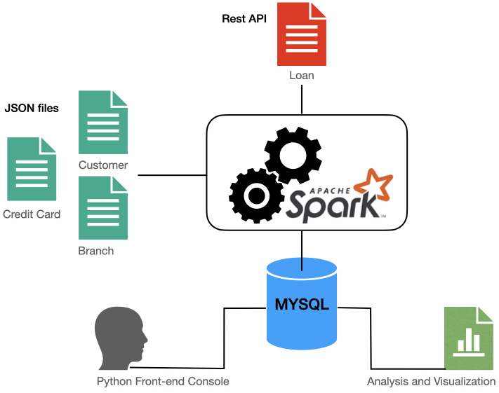
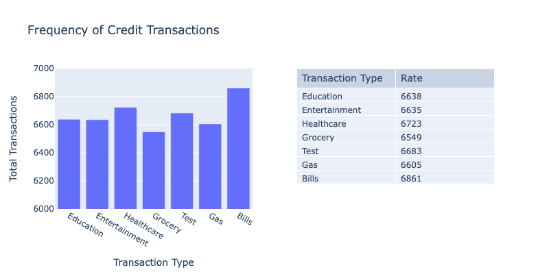
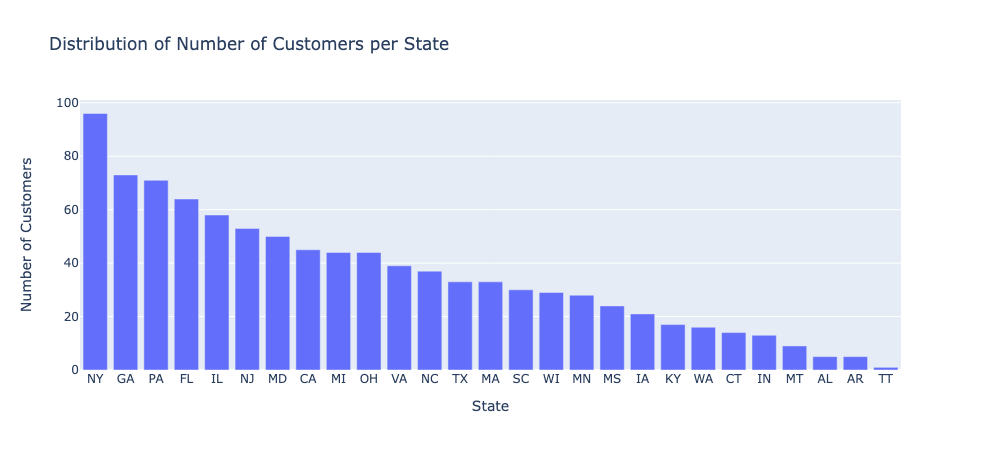
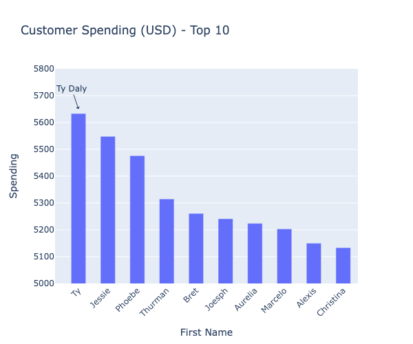
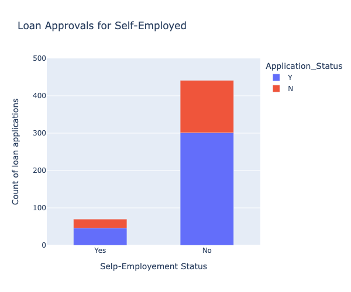
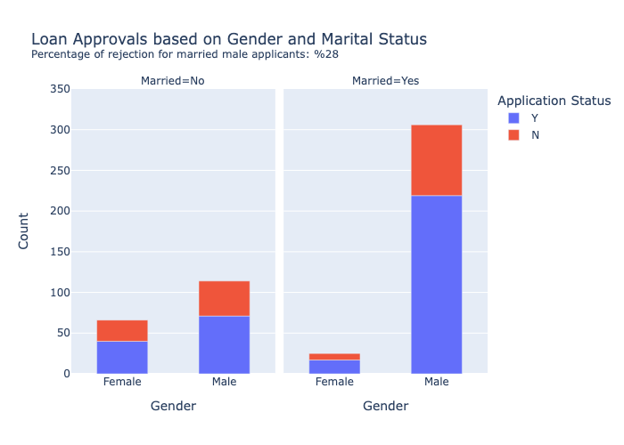
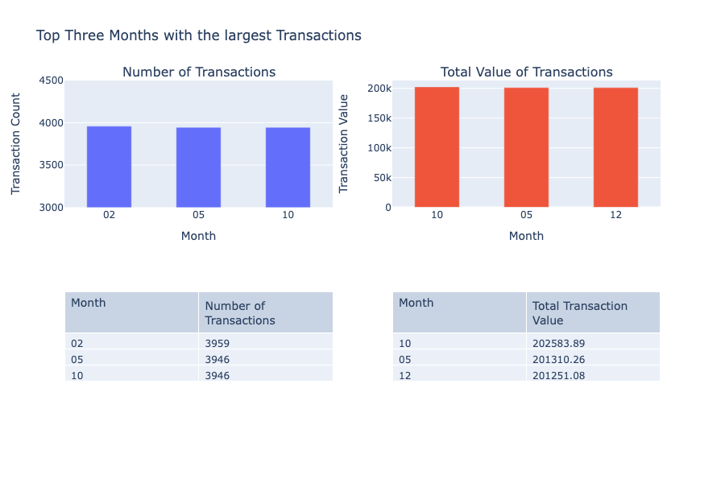
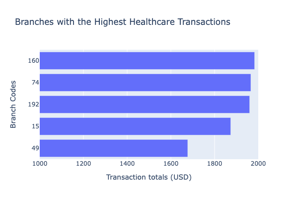

# Data Engineering for Credit Card Data

## An ETL, analysis and visualization project


This project consists of three parts:

1. Create an ETL pipeline:
- Extract data from JSON files (local files and Rest APIs)
- Transform data according to specific [mappings](https://docs.google.com/spreadsheets/d/1t8UxBrUV6dxx0pM1VIIGZpSf4IKbzjdJ/edit#gid=1823293337)
- Create a MySQL database and load data into tables

2. Application Front-End:
- Write python front-end to query MySQL database and modify and update existing records

3. Analyze and visualize data 

### What is in this repo:
- **config.ini**: The file with the data source and size information, parsed by etl.py.

- **mapping.py**: The file with the dictionaries for data transformations. Includes dictionaries for the below mappings:
    -   {JSON file} --> {SparkDF} transformations 

    -   {SparkDF variable types} --> {MySQL variable types}

    -   {SparkSQL temp table name} --> {MySQL database table name}

- **etl.py**: The python code to extract and transform data, and create a database "creditcard_capstone" and load data into tables.

- **analysis_frontend.py**: Front-end to interact with the user to run queries and update records.

- **functions.py**: The collection of functions to support the ETL and interactive menus.

- **/notebooks/*.ipynb**: Notebooks for setup, test and visualizations.

### How to run:
```
pip install -r requirements.txt
python etl.py
python analysis_frontend.py
```
### Other Requirements:
1. MySQL database root password needs to be set as "mysql_root_p" environment variable 
2. Python>=3.0

### Technical Challenges
1. Spark SQL doesn't support UPDATE statements, so instead for the updates I used "mysql.connector", other than that almost everything is done with PySpark. Except, in visualizations, Pandas has the advantage, so I used sparkDF.toPandas() to work with Pandas dataframes.
2. For the first menu version I used input(). This created a more complicated interface; using [pyinputplus](https://pyinputplus.readthedocs.io/en/latest/) module improved the interface significantly.

### Visualization 
I answered the following inquiries using SparkSQL, pandas and plotly libraries.

#### Req. 3 Data Analysis and Visualization
1. Find and plot which transaction type has a high rate of transactions.



2. Find and plot which state has a high number of customers.



3. Find and plot the sum of all transactions for each customer, and which customer has the highest transaction amount.



#### Req.5 Data Analysis and Visualization for Loan Application

1.   Find and plot the percentage of applications approved for self-employed applicants.



2.    Find the percentage of rejection for married male applicants.



3.   Find and plot the top three months with the largest transaction data.



4.    Find and plot which branch processed the highest total dollar value of healthcare transactions.



See additional visualizations at Tableau Public [here](https://public.tableau.com/app/profile/sue4897/viz/test1_loan/Dashboard1) and [here](https://public.tableau.com/app/profile/sue4897/viz/test2_credit/dashboard_Req3)