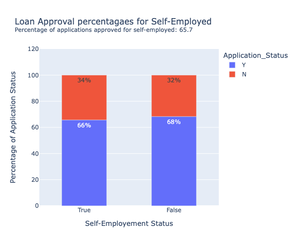

# Data Engineering for Credit Card Data

## An ETL, analysis and visualization project


This project consists of three parts:

1. ETL:
- Create an ETL pipeline to extract data from Json files (local files and files from Rest APIs)
- Transform data according to specific mappings 
- Create a MySQL database and load data into tables

2. Application Front-End:
- Write python front-end to query MySQL database and modify and update existing records

3. Analyze and visualize data 

### How to run:
```
pip install -r requirements.txt
python etl.py
python analysis.py
```
### Other Requirements:
1. MySQL database root access requires "mysql_root_p" environment variable to be set
2. Python>=3.0

### Visualization answered the following inquiries using SparkSQL, pandas and plotly libraries.

### Req. 3 Data Analysis and Visualization
1. Find and plot which transaction type has a high rate of transactions.


2. Find and plot which state has a high number of customers.


3. Find and plot the sum of all transactions for each customer, and which customer has the highest transaction amount.


### Req.5 Data Analysis and Visualization for Loan Application

1.   Find and plot the percentage of applications approved for self-employed applicants.




2.    Find the percentage of rejection for married male applicants.


3.   Find and plot the top three months with the largest transaction data.


4.    Find and plot which branch processed the highest total dollar value of healthcare transactions.

